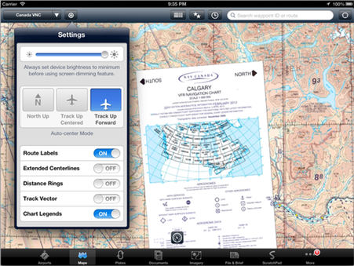

Flight Bag Tiles
================


Overview
--------

The Flight Bag Tiles ("FBTiles") database format is an open database
specification invented by [ForeFlight](http://www.foreflight.com) for packaging
geo-referenced chart tiles in SQLite databases  for use in mobile, desktop, and
web applications. The FBTiles specification is free for app makers, website
developers, and national Aeronautical Information Publishers ("AIPs") to use in
order to accelerate digital charting initiatives.


Database Specification
----------------------

To ensure compatiblity with devices, you must adhere to the specification as
documented below.

While no formal relationship exists between the
[MBTiles](http://www.mbtiles.org) specification and FBTiles, the FBTiles format
can be viewed as a superset of MBTiles. This is primarily due to the addition
of of what we call "collared" data. Collared data is so-called because it
relates to additional/alternate tiles that appear around the edges of the
original tiles found in the 'tiles' table.


### Collared Data Concept Explained

\


While collared tiles may suggest a certain geometry, don't be confused about
their general application or uses. You can simply view the additional collared
tile as an alternative tile data to display or not. In the screenshot example
above, the chart legends are stored as collared data, to be turned on or off as
legend data in the application.

The possibilities really are limitless; you could have the original map tiles
appear and then have a secondary set of tiles stored in the tile_collar_data
column that are like the original, completely different, or with additional markup.

In future versions of FBTiles these general concepts may be further enhanced to
allow for effecient delivery of multiple tile versions and formats.

### Table and Index Creation

Initial steps towards creating your own data in the FBTiles format involves
creating three new tables, bounds, datatypes, and tiles. In addition to these
three tables are the corresponding indexes that may be of use in your
application as well, but are specifically tailored to meet the requirements for
ForeFlight's application if you intend on using your FBTiles therein.

Additionally, while the basic SQL is database agnostic, for compatibility with
ForeFlight, you should adhere to SQLite (as shown below) as you will be
required to upload SQLite files for use within ForeFlight.

```sql
CREATE TABLE bounds (zoom INTEGER,
                     collared INTEGER,
                     maxX INTEGER,
                     maxY INTEGER,
                     minX INTEGER,
                     minY INTEGER,
                     PRIMARY KEY (zoom, collared));
```

```sql
CREATE TABLE [datatypes] (id INTEGER PRIMARY KEY,
                          datatype TEXT UNIQUE);

CREATE INDEX datatypes_idx ON datatypes(datatype);
```

```sql
CREATE TABLE tiles  (tilekey INTEGER PRIMARY KEY,
                     zoom_level INTEGER,
                     tile_row INTEGER,
                     tile_column INTEGER,
                     tile_data BLOB,
                     tile_datatypes_id INTEGER,
                     tile_collar_data BLOB,
                     tile_collar_datatypes_id INTEGER,
        FOREIGN KEY (tile_datatypes_id) REFERENCES datatypes(id),
        FOREIGN KEY (tile_collar_datatypes_id) REFERENCES kdatatypes(id));

CREATE INDEX tiles_idx ON tiles(zoom_level,
                                tile_row,
                                tile_column);

CREATE INDEX tiles_zoom_idx ON tiles(zoom_level);
```

### Columns

 * Tiles Table
    + `tilekey`: unique integer
    + `zoom_level`: integer values from `0` (highest) - `17` (lowest) zoom
    + `tile_row`: row or X-value for tile
    + `tile_column`: column or Y-value for tile
    + `tile_data`: BLOB for image data (no format assumed)
    + `tile_datatypes_id`: refers to format of BLOB in separate table
    + `tile_collar_data`: BLOB for collared image data (no format assumed)
    + `tile_collar_datatypes_id`: refers to format of BLOB in separate table
 * Bounds Table
    + `zoom`: zoom levels are integer values `0-17`
    + `collared`: `0` or `1`, corresponding to True/False, collared or not
    + `maxX`: maximum X value for zoom-collared key pair.
    + `maxY`: maximum Y value for zoom-collared key pair.
    + `minX`: minimum X value for zoom-collared key pair.
    + `minY`: minimum Y value for zoom-collared key pair.
 * Data Types Table
    + `id`: unique integer
    + `datatype`: unique text for image format (either `PNG`, or `JPG`)

While the specification is open-ended enough to allow for `tile_data` or
`tile_collar_data` to contain any type of image format, at this point in time
only `PNG` or `JPG` will be recognized and supported within ForeFlight's use of
FBTiles spec.


Examples
--------

**Examples and source code will be coming shortly.**

<!-- Included in this repository are a number of examples using Python to construct
an FBTiles dataset as a SQLite file. -->


Versions
--------

 * 1.0
    + Introduces FBTiles schema with collared data concepts.


References
----------

 * [ForeFlight](http://www.foreflight.com)
 * [MBTiles](http://www.mbtiles.org)
 * [MapBox](http://www.mapbox.com)
 * [Creative Commons Attribution 3.0 United States
License](http://creativecommons.org/licenses/by/3.0/us/).

License
-------

The text of this specification is licensed under a
[Creative Commons Attribution 3.0 United States
License](http://creativecommons.org/licenses/by/3.0/us/).
However, the use of this spec in products and code is entirely free: there are
no royalties, restrictions, or requirements.

Authors
-------

 * Adam Houghton
 * Kevin Turner (ksturner)
 * Matt Croydon (mcroydon)
